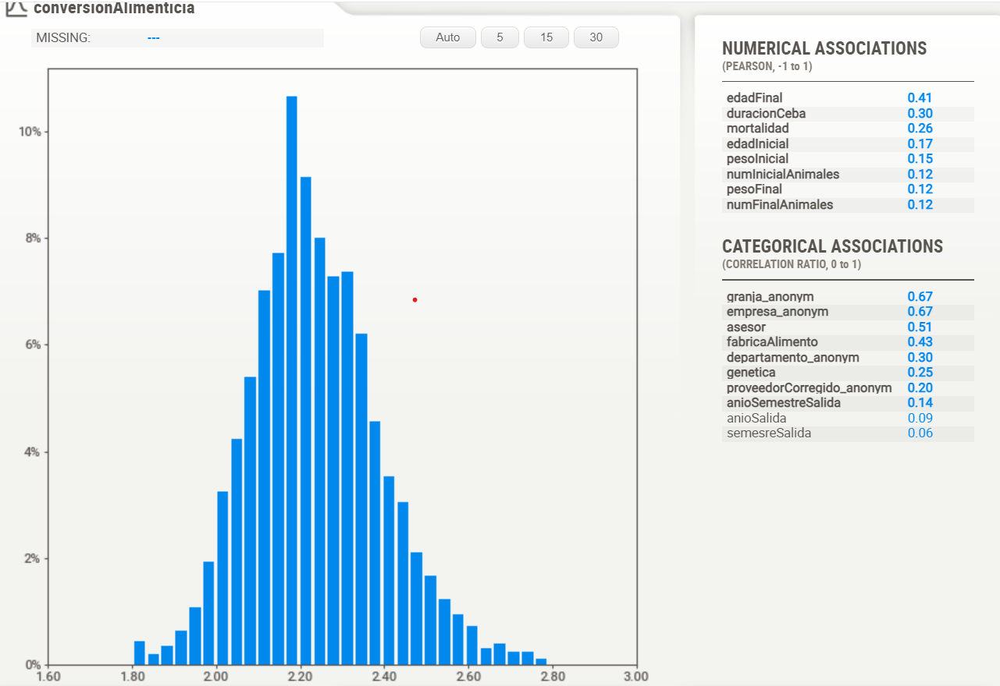

**Prueba técnica**

El presente reprositorio contiene el
análisis y resultados de la prueba técnica
para el cargo de científico de datos en Okuo.

La primera parte es una sección de exploración
y entendimiento de los datos, la cual se puede
encontrar en el notebook ``exploration.ipynb``.

Luego tendremos la sección de modelado en la cual
transformamos y entrenamos diferentes modelos para
luego interpretarlos y realizar predicciones ``pycaret.ipynb``

Por último se crea un dashboard interactivo
donde se da algunas explicación de como entender
la conversión alimenticia en base ciertos predictores.

Tablero despledado en:

https://sorkftkbpt4x4hda4s9pzn.streamlit.app/

Ejecutar en local:
 `streamlit run .\tablero.py`
